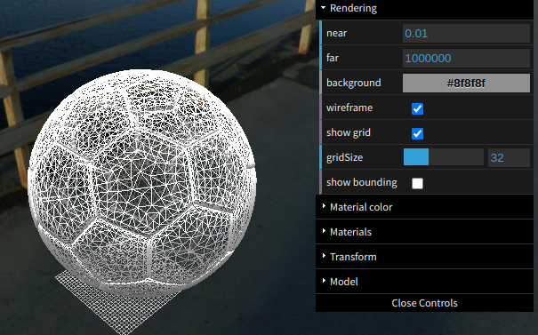
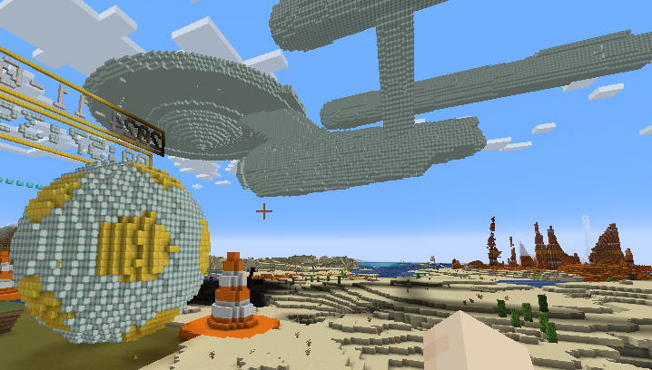
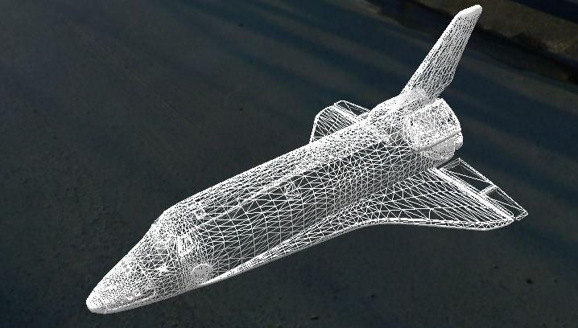

# Minecraft - Render Obj 3D Model version 3

I forked this project for rendering objects with the new minecraft_remote plugin.

For VS Code, you can use the extension "3D Viewer for VSCode" to view the 3D model in the editor.
vscode://settings/3dviewer.grid

## Original README
-------------------------------------------------------------------------------
Minecraft - Render Obj 3D Model version 2
Martin O'Hanlon (martin@ohanlonweb.com)
http://www.stuffaboutcode.com
-------------------------------------------------------------------------------

A program which takes a 3d model in an obj file and renders it into minecraft
Version 2 creates full models, not just wireframes and support using different
types of blocks for different materials in the model
http://www.stuffaboutcode.com/2013/04/minecraft-pi-edition-3d-models-version-2.html

------------------------------------------------------------------------------

Version history
2.1 - first beta release

-------------------------------------------------------------------------------
